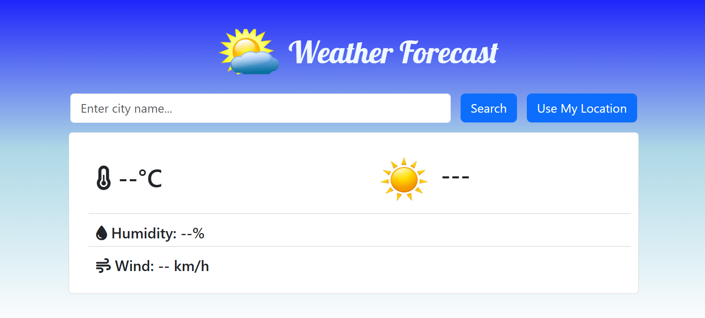
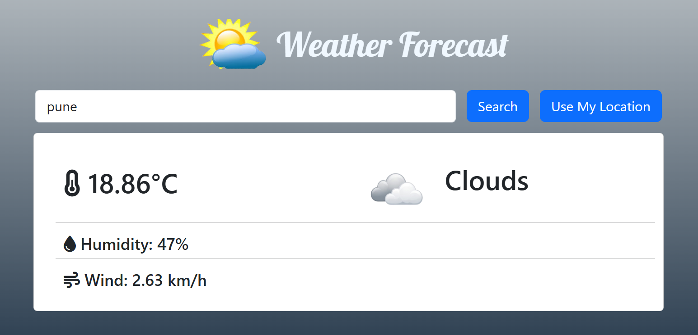

# 🌦️ Weather Forecast Web App

A simple and responsive **Weather Forecast Web Application** built using **Python Flask** that allows users to search for real-time weather information of any city.

---

## 🚀 Features

* 🔍 Search weather by city name
* 🌡️ Displays temperature, humidity, and weather condition
* ☁️ Real-time data using a weather API
* 🎨 Clean and responsive UI
* ⚙️ Backend powered by Flask

---

## 🛠️ Tech Stack

* **Backend:** Python, Flask
* **Frontend:** HTML, CSS, JavaScript, Bootstrap
* **API:** OpenWeatherMap API

---

## 📂 Project Structure

```
weather-forecast-flask/
│── app.py
│── requirements.txt
│── .gitignore
│── templates/
│   └── index.html
│── static/
│   ├── css/
│   └── js/
│── README.md
```

---

## ⚙️ Installation & Setup

1. **Clone the repository**

```bash
git clone https://github.com/tanmaypansare/weather-forecast.git
```

2. **Navigate to project folder**

```bash
cd weather-forecast
```

3. **Create virtual environment (optional but recommended)**

```bash
python -m venv venv
```

4. **Activate virtual environment**

* Windows:

```bash
venv\Scripts\activate
```

* Linux / macOS:

```bash
source venv/bin/activate
```

5. **Install dependencies**

```bash
pip install -r requirements.txt
```

6. **Run the application**

```bash
python app.py
```

7. Open browser and visit:

```
http://127.0.0.1:5000/
```

---

## 🔑 API Key Setup

* Create an account on **OpenWeatherMap**
* Generate an API key
* Add your API key inside `app.py`

```python
API_KEY = "your_api_key_here"
```

> ⚠️ Do not upload your API key to GitHub. Use environment variables for production.

---

## 📸 Screenshots

### Home Page


### Weather Result


---

## 📌 Future Improvements

* 🌍 Auto-detect location weather
* 📱 Improved mobile responsiveness
* 🌙 Dark / Light mode
* 📊 Weekly forecast

---

## 👨‍💻 Author

**Pansare Tanmay**
Aspiring Full Stack Developer | Python | IoT | Web Development

---

## ⭐ Support

If you like this project, don’t forget to **star ⭐ the repository**!
